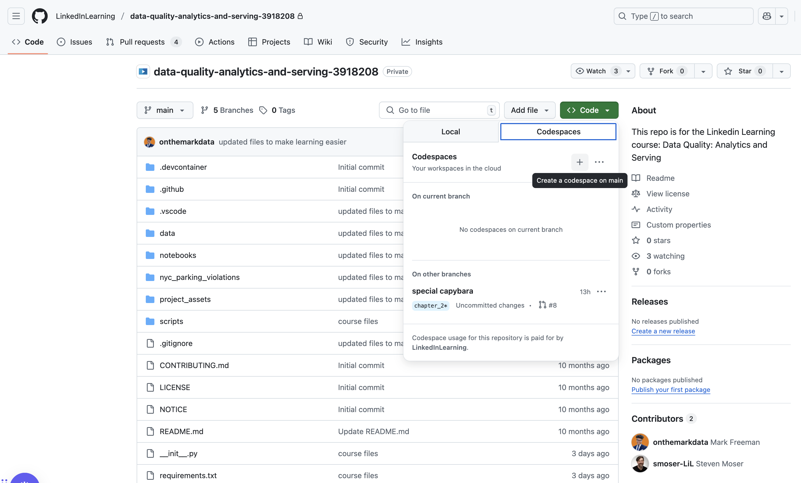
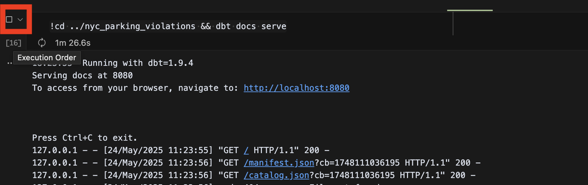
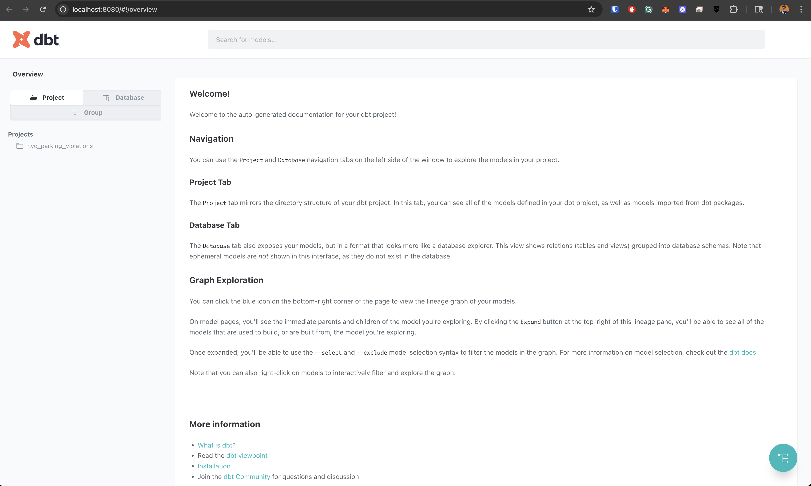
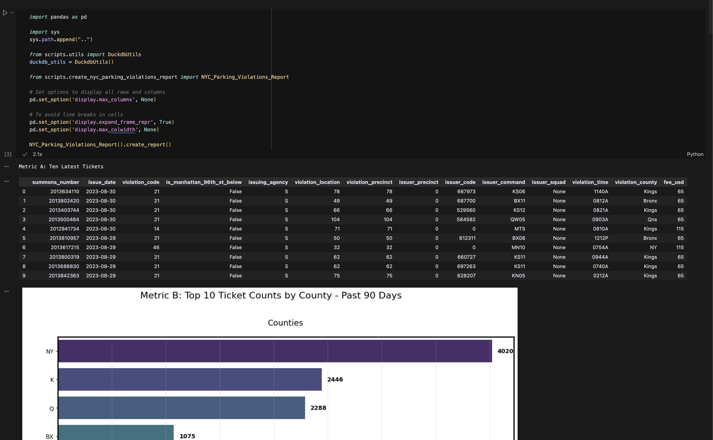
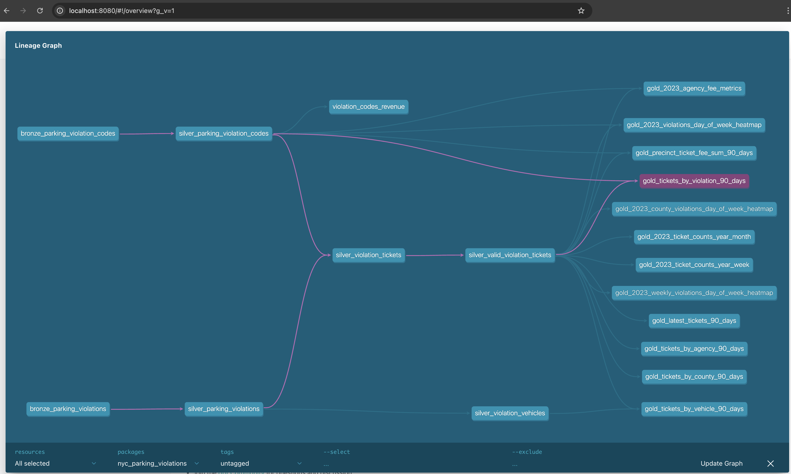
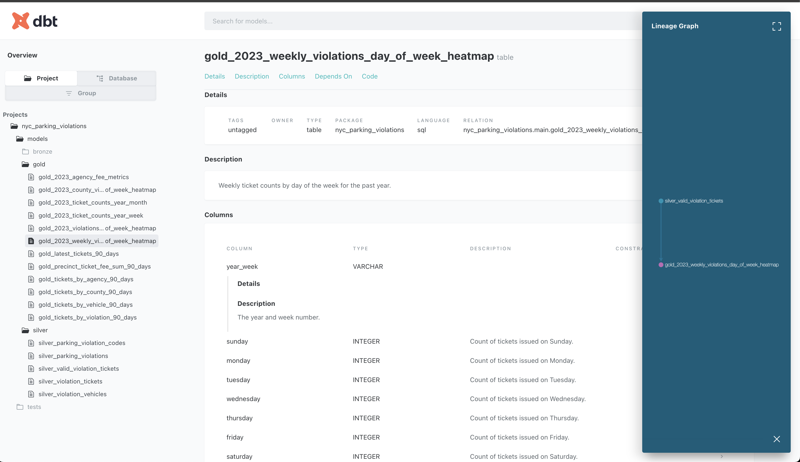

# LinkedIn Learning: Data Quality Downstream Project Walkthrough

### Scenario:

In this project you are a data engineer that's been tasked with resolving data quality issues found by your business stakeholders downstream. Specifically, your stakeholders are in the middle of monthly reporting that relies heavily on NYC parking violations data and thus need an urgent fix.

Your previous implementation of dbt was a huge success and everyone in the dept uses assets off of it. Unfortunately, your department has been plagued by data quality issues lately, and the department's main report that leadership reads is completely wrong. Last week the report was perfect, but today it's a complete mess

Thankfully your manager saved a report from right before the issues showed up, thus your goal is to get the report back to the accurate state before the major dept meeting next week. You also need to create a RCA report to share with the data team to help prevent future issues.

By the end of this project, you should be able to conduct a root cause analysis on data quality issues, clearly communicate the issues and potential solution to relevant parties, and implement a data quality fix.

### Data:

This project utilizes two public government datasets sourced from NYC Open Data:

**1. [NYC Parking Violations Issued - Fiscal Year 2023](https://data.cityofnewyork.us/City-Government/Parking-Violations-Issued-Fiscal-Year-2023/pvqr-7yc4)**  
> Parking Violations Issuance datasets contain violations issued during the respective fiscal year. The Issuance datasets are not updated to reflect violation status, the information only represents the violation(s) at the time they are issued. Since appearing on an issuance dataset, a violation may have been paid, dismissed via a hearing, statutorily expired, or had other changes to its status. To see the current status of outstanding parking violations, please look at the Open Parking & Camera Violations dataset.

Note that this dataset is rather large for this project, so we will use a sample of 100K records.

**2. [NYC Department of Finance Parking Violation Codes](https://data.cityofnewyork.us/Transportation/DOF-Parking-Violation-Codes/ncbg-6agr)**  
> This dataset defines the parking violation codes in New York City and lists the fines. Each fine amount includes a $15 New York State Criminal Justice surcharge.

### Project Structure:
```
linkedin-learning-dq-downstream/
├── nyc_parking_violations/                    # Main DBT project directory
│ ├── models/                                  # Database models organized in medallion architecture
│ │ ├── bronze/                                # Raw data ingestion layer
│ │ ├── silver/                                # Data transformation and cleansing layer
│ │ ├── gold/                                  # Analytics and reporting layer
│ │ └── docs/                                  # Documentation for the models
│ ├── tests/                                   # DBT tests directory
├── data/                                      # Raw data directory
├── project_assets/                            # Additional project documentation
│ |── project_walkthrough.md                   # Project walkthrough documentation
│ └── NYC_Parking_Violations_Report            # Original Report Without Data Quality Issues
├── scripts/                                   # Python scripts directory
│ ├── create_nyc_parking_violations_report.py  # Report generation script
│ └── utils.py                                 # Utility functions
├── notebooks/                               # Notebooks to run code
│ ├── 1_run_data_pipelines_here.ipynb        # Jupyter notebook for data pipeline execution
│ ├── 2_run_report_here.ipynb                    # Jupyter notebook for report execution
│ ├── 3_run_sql_queries_here.ipynb               # Jupyter notebook for SQL queries
│ └── 4_root_cause_analysis_report.md            # Markdown to document root cause analysis
└── requirements.txt                           # Python dependencies
```

# **Hands-On Coding Project**

> Note: This repo is organized in branches that you switch on based on the chapter and section (denoted as `chapter_section_topic`; example: `01_04_data_infra_reports`). This is intentional to ensure learners can follow along without worrying about messing something up or getting stuck at a particular step. Just switch to the corresponding branch like a checkpoint in a video game!

## *Chapter 1*

### 01_01_project_scenario
This project utilizes two public government datasets sourced from NYC Open Data:
- NYC Parking Violations Issued - Fiscal Year 2023 (100k Record Sample)
- NYC Department of Finance Parking Violation Codes

> **A very important note about the data: Given that the data is sampled, assume for this project that the latest "correct" data is for August 30th, 2023.**

For this project we will use a method called ["chaos engineering"](https://netflixtechblog.com/the-netflix-simian-army-16e57fbab116) where you intentionally break your system to understand how robust your protections and reliability are. I think it's a perfect approach for practicing data quality skills!

In addition, while this course can be taken standalone, the following LinkedIn Learning courses would be a great foundation (optional):
- [Data Quality: Core Concepts](https://www.linkedin.com/learning/data-quality-core-concepts)
    - Covers many of the data quality theoretical concepts.
- [Data Engineering with dbt](https://www.linkedin.com/learning/data-engineering-with-dbt)
    - Familiarity with data build tool (dbt) and working with the NYC Parking Violations dataset.

    - Don't worry if you have never used dbt before, as I created notebooks that will run all the needed commands for you and will have a video on how to access the data catalog, lineage, and dictionary generated by dbt.

Finally, there are three ways to approach taking this course for your learning:
- ***Option 1:*** Actively watch the videos but don't go through the hands-on project.

- ***Option 2:*** Actively watch the videos and follow along coding with the hands-on project.

- ***Option 3:*** Actively watch the videos, and instead of following along, pause the video and try to do the data quality resolution step yourself and then watch the video for an answer.

All three options are valid forms of learning, and I actively use all three approaches for my own learning!

### 01_02_codespaces_and_repo_overview
While you can run this project on your local machine, I suggest using Github Codespaces (LinkedIn Learning provides it to learners for free!) as that's what I'll be using in the course videos.

Starting up codespaces is simple:
1. Click the green "< > Code" button.
2. Select "Codespaces."
3. Press the "+" button.
4. Wait for the environment to build for a couple minutes.
5. Start coding with a real-world environment in the browser!



Once you are in the project Codespace, you should see the following repo structure:
```
linkedin-learning-dq-downstream/
├── nyc_parking_violations/                    # Main DBT project directory
│ ├── models/                                  # Database models organized in medallion architecture
│ │ ├── bronze/                                # Raw data ingestion layer
│ │ ├── silver/                                # Data transformation and cleansing layer
│ │ ├── gold/                                  # Analytics and reporting layer
│ │ └── docs/                                  # Documentation for the models
│ ├── tests/                                   # DBT tests directory
├── data/                                      # Raw data directory
├── project_assets/                            # Additional project documentation
│ |── project_walkthrough.md                   # Project walkthrough documentation
| |── NYC_Parking_Violations_Report.ipynb      # Original Report Without Data Quality Issues (Codespace viewing)
│ └── NYC_Parking_Violations_Report.pdf        # Original Report Without Data Quality Issues (local viewing)
├── scripts/                                   # Python scripts directory
│ ├── create_nyc_parking_violations_report.py  # Report generation script
│ └── utils.py                                 # Utility functions
├── notebooks/                                 # Notebooks to run code
│ ├── 1_run_data_pipelines_here.ipynb          # Jupyter notebook for data pipeline execution
│ ├── 2_run_report_here.ipynb                  # Jupyter notebook for report execution
│ ├── 3_run_sql_queries_here.ipynb             # Jupyter notebook for SQL queries
│ └── 4_root_cause_analysis_report.md          # Markdown to document root cause analysis
└── requirements.txt                           # Python dependencies
```

### 01_03_cli_and_dbt_docs
Since this course is about solving data quality issues downstream and *not* using the CLI or dbt, I have abstracted away many of the dbt and script commands in the `notebooks/` directory via the following notebook files and custom utility functions where you just need to run the cells in:

`1_run_data_pipelines_here.ipynb`
```python
# Import Custom Utility Functions
import sys
sys.path.append("..")

from scripts.utils import DuckdbUtils

duckdb_utils = DuckdbUtils()
```

The below cells use the `!` command in Jupyter notebooks that allow you run bash commands (i.e. CLI) within the notebook cell.

```python
# Load clean data into database and run pipelines
duckdb_utils.load_csv_file_to_db('../data/clean_data')
!cd ../nyc_parking_violations && dbt run && dbt docs generate
```
```python
# Load dirty data into database and run pipelines
duckdb_utils.load_csv_file_to_db('../data/dirty_data')
!cd ../nyc_parking_violations && dbt run && dbt docs generate
```
^ Both of the loading data functions does a complete rebuild of the entire database and pipelines, so make sure you know if you which one you are doing SQL queries on in later steps!

Finally, you can review all the documentation, lineage, and data catalog of all the data assets and pipelines via the docs generate and serve function of dbt (huge reason why we are using dbt for this project). This will create a local-host file that will run in the browser (Codespaces will automatically port forward this to create the same behavior).
```python
!cd ../nyc_parking_violations && dbt docs serve
```
>*NOTE: This runs an interactive server in the background. You must end the notebook cell by pressing the stop "square" on the top left next to the cell when done (the error message is expected behavior). Not doing this will prevent you from running other notebook cells. You will still be able to access the interactive website even if this is not running, it's just needed to start it up.*



### 01_04_data_infra_reports
Now that we know how to setup the data environment and access all related documentation via dbt docs, we can now run the report that we will need to fix and query the database. Again, I've abstracted everything via notebook cells so we only focus on learning data quality:

`2_run_report_here.ipynb`

Just run the following cell and it will generate Metrics A through M which is a collection of tables and visualization.
```python
import pandas as pd

import sys
sys.path.append("..")

from scripts.utils import DuckdbUtils
duckdb_utils = DuckdbUtils()

from scripts.create_nyc_parking_violations_report import NYC_Parking_Violations_Report

# Set options to display all rows and columns
pd.set_option('display.max_columns', None)

# To avoid line breaks in cells
pd.set_option('display.expand_frame_repr', True)
pd.set_option('display.max_colwidth', None)

NYC_Parking_Violations_Report().create_report()
```


In addition, I created a simple notebook to run SQL queries on the database created in the previous steps:

`3_run_sql_queries_here.ipynb`

First import the custom utility functions:
```python
import sys
sys.path.append("..")

from scripts.utils import DuckdbUtils

duckdb_utils = DuckdbUtils()
```

Now you can run SQL queries via python in your notebook:
```python
sql_query = """
SHOW tables
"""
|
duckdb_utils.run_sql_query_and_return_df(sql_query)
```
Output:
| name                                                 |
|------------------------------------------------------|
| bronze_parking_violation_codes                       |
| bronze_parking_violations                            |
| first_model                                          |
| gold_2023_agency_fee_metrics                         |
| gold_2023_county_violations_day_of_week_heatmap      |
| gold_2023_precinct_violations_day_of_week_heatmap    |
| gold_2023_ticket_counts_year_month                   |
| gold_2023_ticket_counts_year_week                    |
| gold_2023_violations_day_of_week_heatmap             |
| gold_2023_weekly_violations_day_of_week_heatmap      |
| gold_latest_tickets_90_days                          |
| gold_precinct_ticket_fee_sum_90_days                 |
| gold_ticket_metrics                                  |
| gold_tickets_by_agency_90_days                       |
| gold_tickets_by_county_90_days                       |
| gold_tickets_by_location_90_days                     |
| gold_tickets_by_vehicle_90_days                      |
| gold_tickets_by_violation_90_days                    |
| gold_vehicle_ticket_count_90_days                    |
| gold_vehicles_metrics                                |
| parking_violation_codes                              |
| parking_violations_2023                              |
| ref_model                                            |
| silver_parking_violation_codes                       |
| silver_parking_violations                            |
| silver_valid_violation_tickets                       |
| silver_violation_tickets                             |
| silver_violation_vehicles                            |

### 01_05_the_data_quality_resolution_process_downstream

Now that we know how to work with our coding and data environment, we can start practicing the *Data Quality Resolution Process*. This [process is based on an article I wrote](https://dataproducts.substack.com/p/the-data-quality-resolution-process) that details the entire process for upstream and downstream data quality resolution and root cause analysis. The process is slightly adapted to only focus on downstream data quality for this course, but I highly recommend reading the article to best understand the process for this project (and for future reference).

The *Data Quality Resolution Process (Downstream)* consists of the following steps that we will go through in the hands-on coding project:
- 0. Stakeholder Surfaces Issue
- 1. Issue Triage
- 2. Requirements Scoping
- 3. Issue Replication
- 4. Data Profiling
- 5. Downstream Pipeline Investigation
- 6. Implement DQ Fix
- 7. Stakeholder Communication

## *Chapter 2*

### 02_01_exercise_intro

Let's first review the "clean data" report so we understand our baseline that we need to fix towards after we introduce "chaos" via loading in the "dirty data" into the database and pipelines.

Go to `1_run_data_pipelines_here.ipynb` and run the following cells:
```python
import sys
sys.path.append("..")

from scripts.utils import DuckdbUtils

duckdb_utils = DuckdbUtils()
```
```python
# Load clean data into database and run pipelines
duckdb_utils.load_csv_file_to_db('../data/clean_data')
!cd ../nyc_parking_violations && dbt run && dbt docs generate
```
```python
# make sure to stop the cell!
!cd ../nyc_parking_violations && dbt docs serve
```

Take a moment to review the data catalog and lineage to become familiar with the data environment and assets.



Now go to `2_run_report_here.ipynb` and run the following cell and it will generate Metrics A through M which is a collection of tables and visualization.
```python
import pandas as pd

import sys
sys.path.append("..")

from scripts.utils import DuckdbUtils
duckdb_utils = DuckdbUtils()

from scripts.create_nyc_parking_violations_report import NYC_Parking_Violations_Report

# Set options to display all rows and columns
pd.set_option('display.max_columns', None)

# To avoid line breaks in cells
pd.set_option('display.expand_frame_repr', True)
pd.set_option('display.max_colwidth', None)

NYC_Parking_Violations_Report().create_report()
```

Take some time to review the report as you will be comparing it against the "dirty data" report in later steps. So you don't have to keep going back and forth running the pipelines in future steps, I have created a PDF version in `project_assets/NYC_Parking_Violations_Report.pdf` if you are on local, and `project_assets/NYC_Parking_Violations_Report.ipynb` if you are on Codespaces.

### 02_02_exercise_bring_on_the_chaos
Now let's break the report and introduce data quality issues.
> **⚠️ PLEASE NOTE: It's very important you switch to branch `02_02_data_quality_exercise_bring_on_the_chaos` as not only are data issues introduced, but also business logic issues via the SQL code. Switching to the correct branch ensures you see these errors as well!**

Similar to the previous step, go to `1_run_data_pipelines_here.ipynb` and run the following cells (except this time run the "dirty data" pipeline):
```python
# Import Custom Utility Functions
import sys
sys.path.append("..")

from scripts.utils import DuckdbUtils

duckdb_utils = DuckdbUtils()
```
```python
# Load dirty data into database and run pipelines
duckdb_utils.load_csv_file_to_db('../data/dirty_data')
!cd ../nyc_parking_violations && dbt run && dbt docs generate
```

Now go to `2_run_report_here.ipynb` again and run the following cell with the new dirty data in the database, and it will generate bad data quality impacted report. Take a moment to review the impacted report when done.
```python
import pandas as pd

import sys
sys.path.append("..")

from scripts.utils import DuckdbUtils
duckdb_utils = DuckdbUtils()

from scripts.create_nyc_parking_violations_report import NYC_Parking_Violations_Report

# Set options to display all rows and columns
pd.set_option('display.max_columns', None)

# To avoid line breaks in cells
pd.set_option('display.expand_frame_repr', True)
pd.set_option('display.max_colwidth', None)

NYC_Parking_Violations_Report().create_report()
```

**🎉 Congrats, your department leadership is now stressed out about the data they are seeing in the report (talk about job security!).**

Now lets go through the Data Quality Resolution Process to fix the issues, create a root cause analysis (RCA) report, and communicate your findings.

## *Chapter 3*

### 03_01_exercise_issue_scoping
For the sake of course pacing we are going to combine the following steps:
- 0. Stakeholder Surfaces Issue
- 1. Issue Triage
- 2. Requirements Scoping

> *Typically you will either have a process already in place via a ticketing system, or you may need to have a meeting with relevant stakeholders to align on what issue is worth solving. All of which is business and situation specific. This does not mean you accelerate through this in real life just because we are moving fast through these steps on this course. In actuality, this is the most important step in the business environment and at times can take the longest (it just doesn't translate well to coding course).*

Some key things to note:
- Remember in the course [Data Quality: Core Concepts](https://www.linkedin.com/learning/data-quality-core-concepts) we highlighted that data quality is ***not*** about pristine data, but rather being "fit for use" for your stakeholders.

- There very well may be data quality issues in the original "clean data" NYC Parking Violations report, but we need to determine what's in scope and out of scope so you can focus on what's important (especially if you need to fix an issue quickly).

- In this scenario, the priority is getting the data back into a baseline state so that the report matches stakeholder expectations of the orignal report.

- With that said, if we do find data quality issues that are out of scope we should put it into our RCA report as something to fix and triage accordingly (again, all business and situation specific).

We are now ready to start building out our RCA report. I have created the following template in `notebooks/4_root_cause_analysis_report.md` that you can fill out as we go along.

> **⚠️ Warning: Switching branches will overwrite what you put in this file. I suggest keeping track with your own file on a local machine so you can compare your notes with the project walkthrough notes!**

**🛑 STOP HERE AND ATTEMPT FILLING OUT THE `Issue Triage` and `Requirements Scoping` SECTIONS IN `notebooks/4_root_cause_analysis_report.md` BASED ON THE SCENARIO DESCRIPTIONS ONLY (WE WILL LOOK AT THE DATA AND REPORT IN NEXT STEPS).**

```md
# Root Cause Analysis Report
Type your findings here as you go through the course...

**Issue Triage**
- your notes...

**Requirements Scoping**
- your notes...

**Issue Replication**
- your notes...

**Data Profiling**
- your notes...

**Downstream Pipeline Investigation**
- your notes...

**Implement DQ Fix**
- your notes...

**Stakeholder Communication**
- your notes...
```

### 03_02_exercise_issue_scoping

Below is what I wrote in the RCA report, with emphasis on differentiating between short, medium, and long term fixes and what is in scope.

```md
# Root Cause Analysis Report
Type your findings here as you go through the course...

**Issue Triage**
Short Term:
- Get the report working before the meeting with SQL fixes

Medium Term:
- Place DQ checks on found errors that "warn" when the pipeline runs

Long Term:
- Work with upstream teams to ensure proper data collection

**Requirements Scoping**
For this project we will focus on short and medium term impact, but still provide suggestions for long term fix and kick off conversations.

**Issue Replication**
- your notes...

**Data Profiling**
- your notes...

**Downstream Pipeline Investigation**
- your notes...

**Implement DQ Fix**
- your notes...

**Stakeholder Communication**
- your notes...
```

## *Chapter 4*

### 04_01_exercise_issue_replication

Now pull up both the "clean data" and "dirty data" NYC Parking Violation Reports and compare them. Pay special attention to changing numbers and visualization axis values.

The goals of this step are the following:
1. Ensure the data quality issue is not a user error issue from your stakeholder (it happens to the best of us).

2. Understand the "blast radius" of the data quality issue on the report.

3. Begin identifying starting points to investigate to scope down the required work.

For context, what this process does is methodically work through the data assets and data pipelines to make the issue scope smaller and smaller until you have a clear point of the issue and fix.

While it's possible to review EVERYTHING, in a real-world situation you may have hundreds or thousands of tables; or have limited time (sometimes hours) and need to prioritize your time. You will have a better sense of what to prioritize the more repetitions you get doing this work (a data 6th sense).

**🛑 STOP HERE AND ATTEMPT FINDING THE ISSUES YOURSELF BEFORE SEEING THE ANSWERS BELOW. ADD YOUR FINDINGS TO `Issue Replication` IN `4_root_cause_analysis_report.md`.**

### 04_02_exercise_issue_replication

Below are the issues I found with the "dirty_data" report:

```md
**Issue Replication**

Metric A
- `violation_location` went from a float to an int... strange, but probably not an issue
- `violation_county` is showing multiple new spellings for the "kings" value

Metric B
- County field changed and showing multiple spelling of "kings"
- Number of tickets are different, but unsure if it's just the repeat county names

Metric C
- `PHTO SCHOOL ZN SPEED VIOLATION` completely missing despite being the highest ticket count
- Counts are relatively the same for some, so need to looking further into the issue

Metric D
- Issue Agency `V` is missing
- New Issue Agency `XYZ` is now here, but it looks like a placeholder value (need to explore more)

Metric E
- Vehicle looks relatively the same, but ticket counts are drastically different like other graphs

Metric F
- Total ticket revenue went from ~$1.4M to ~$805k
- This is a massive difference and will cause the most alarm and need to prioritize

Metric G
- MAJOR FIND
- `Precinct 0` dropped from ~$664k to $50k while the numbers for all the precinct stayed the same
- That ~$600k difference is also about the same as the difference in Metric F

Metric H
- Relatively same distribution but the Average nearly dropped in half.

Metric I
- Distributions are relatively the same, so not worth focusing on at first

Metric J
- Seeing Agency XYZ again, and now agency V is missing

Metric K
- A complete drop off of values on Sunday

Metric L
- Similar issue for `county` value where we are seeing duplicate names but spelled differently

Metric M
- `PHTO SCHOOL ZN SPEED VIOLATION` completely missing similar to Metric C
- Notably most of the Sunday tickets are `PHTO SCHOOL ZN SPEED VIOLATION`, which may explain Metric K
```

## *Chapter 5*

### 05_01_exercise_data_profiling_part_1

While we can profile every single table... that will take way too long since we are on a short timeline.

Instead, let's take our findings in "Issue Replication" and filter down to what would be the most impactful data assets to review.

Below is what I added to `Data Profiling` in `4_root_cause_analysis_report.md`.
```md
Areas of Interest Worth Exploring:

1. Revenue and Precinct Data
    - Reasoning: Metrics F and G showed significant financial discrepancies.

    - Total ticket revenue dropped from ~$1.4M to ~$805k (Metric F).

    - Precinct 0 experienced a substantial revenue drop (~$664k to $50k) while other precincts remained stable (Metric G).

2. Violation Type Data
    - Reasoning: Metrics C and M indicate critical missing data.

    - `"PHTO SCHOOL ZN SPEED VIOLATION"` completely disappeared, significantly impacting daily counts, particularly on Sundays (Metrics C, M, K).

3. County Data
    - Reasoning: Metrics A, B, and L indicate county name inconsistencies.

    - Multiple new spellings or variations for `"Kings"` and `"Queens"` county appeared.

4. Issuing Agency Data
    - Reasoning: Metrics D and J highlight issues with issuing agencies.

    - Known agency `V` disappeared, and a new placeholder agency `XYZ` emerged.
```

### 05_02_exercise_data_profiling_part_1

We can now use the data lineage to give us an understanding of which tables and values to profile first.


**Values of Interest:**

**🛑 STOP HERE AND ATTEMPT IDENTIFYING THE TABLES AND COLUMNS YOURSELF BEFORE SEEING THE ANSWERS BELOW. ADD YOUR FINDINGS TO `Data Profiling` IN `4_root_cause_analysis_report.md`.**

### 05_03_exercise_data_profiling_part_1

Below is what I added to `Data Profiling` in `4_root_cause_analysis_report.md`:

```md
All Gold metrics of interest are sourced from `silver_valid_violation_tickets` and `silver_parking_violation_codes`, thus those two tables and columns will be our starting point.

- `silver_valid_violation_tickets`
    - `violation_precinct`
    - `fee_usd`
    - `violation_code`
    - `violation_county`
    - `issuing_agency`

- `silver_parking_violation_codes`
    - `violation_code`
    - `definition`
```

We also want to explore these value ***one node** before a table in the data lineage to see if there is a change in the values. Then repeat this process until we find a difference or reach the earliest layer of ingestion.

If we see a difference between two tables, it typically means its a business logic error in the SQL. If it's seen all the way to the ingestion layer, it implies that the data itself has errors and you must work with upstream stakeholders to resolve and or implement business logic to resolve the issue downstream as a band-aid solution (i.e. take on tech debt).

Below is also what I added to `Data Profiling` in `4_root_cause_analysis_report.md` to account for further exploration:

```md
We also want to explore the following pipeline chains:

- `silver_valid_violation_tickets` -> `silver_violation_tickets`

- `silver_violation_tickets` -> `silver_parking_violation_codes`

- `silver_violation_tickets` -> `silver_parking_violations`

- `silver_parking_violation_codes` -> `bronze_parking_violation_codes` (ingestion layer)

- `silver_parking_violations` -> `bronze_parking_violations` (ingestion layer)
```

We have now successfully scoped down to the exact tables and values we need to query and SQL scripts to explore to hopefully resolve the data quality issues. In the next step we will start running SQL queries against the dirty data database.

## *Chapter 6*

### 06_01_exercise_data_profiling_queries_part_2

Rather than do one off queries, I suggest joining these values together to see the changes in one table. This will also serve as the foundation for data quality checks we will place later.

Let's do the first one together and then you can attempt subsequent queries.

Go to `notebooks/3_run_sql_queries_here.ipynb` and load the utility functions by running the following cell:
```python
import sys
sys.path.append("..")

from scripts.utils import DuckdbUtils

duckdb_utils = DuckdbUtils()
```

Now you can run your SQL queries in subsequent cells. Make sure to wrap your SQL query in the utility function!
```python
sql_query = """
YOUR QUERY HERE
"""
|
duckdb_utils.run_sql_query_and_return_df(sql_query)
```

For the first table, I want to understand the unique counts and sums of key values across the data pipeline to determine if we have data issues or business logic issues within the SQL queries.

Here is the query I used and the subsequent results:
```sql
WITH table_metrics AS (
    SELECT 
        COUNT(DISTINCT violation_precinct) AS unique_precinct_count,
        COUNT(DISTINCT violation_code) AS unique_violation_code_count,
        COUNT(DISTINCT violation_county) AS unique_violation_county_count,
        COUNT(DISTINCT issuing_agency) AS unique_issuing_agency_count,
        SUM(fee_usd) AS total_revenue,
        MIN(issue_date) AS earliest_issue_date,
        MAX(issue_date) AS latest_issue_date,
        '4.silver_valid_violation_tickets' AS table_name
    FROM
        silver_valid_violation_tickets

    UNION

    SELECT 
        COUNT(DISTINCT violation_precinct) AS unique_precinct_count,
        COUNT(DISTINCT violation_code) AS unique_violation_code_count,
        COUNT(DISTINCT violation_county) AS unique_violation_county_count,
        COUNT(DISTINCT issuing_agency) AS unique_issuing_agency_count,
        SUM(fee_usd) AS total_revenue,
        MIN(issue_date) AS earliest_issue_date,
        MAX(issue_date) AS latest_issue_date,
        '3. silver_violation_tickets' AS table_name
    FROM
        silver_violation_tickets

    UNION

    SELECT 
        COUNT(DISTINCT violation_precinct) AS unique_precinct_count,
        COUNT(DISTINCT violation_code) AS unique_violation_code_count,
        COUNT(DISTINCT violation_county) AS unique_violation_county_count,
        COUNT(DISTINCT issuing_agency) AS unique_issuing_agency_count,
        'Value not available' AS total_revenue,
        MIN(issue_date) AS earliest_issue_date,
        MAX(issue_date) AS latest_issue_date,
        '2. silver_parking_violations' AS table_name
    FROM
        silver_parking_violations

    UNION

    SELECT 
        COUNT(DISTINCT violation_precinct) AS unique_precinct_count,
        COUNT(DISTINCT violation_code) AS unique_violation_code_count,
        COUNT(DISTINCT violation_county) AS unique_violation_county_count,
        COUNT(DISTINCT issuing_agency) AS unique_issuing_agency_count,
        'Value not available' AS total_revenue,
        MIN(issue_date) AS earliest_issue_date,
        MAX(issue_date) AS latest_issue_date,
        '1. bronze_parking_violations' AS table_name
    FROM
        bronze_parking_violations
)
SELECT * FROM table_metrics ORDER BY table_name ASC
```

Results:
| Table Name                          | Unique Precincts | Unique Violation Codes | Unique Counties |
|-------------------------------------|------------------|------------------------|-----------------|
| bronze_parking_violations           | 80               | 76                     | 17              |
| silver_parking_violations           | 80               | 76                     | 17              |
| silver_violation_tickets            | 80               | 76                     | 17              |
| silver_valid_violation_tickets      | 77               | 66                     | 13              |

| Table Name                          | Unique Issuing Agencies | Total Revenue       | Earliest Issue Date | Latest Issue Date |
|-------------------------------------|-------------------------|---------------------|---------------------|-------------------|
| bronze_parking_violations           | 25                      | Value not available | 2000-05-21          | 2029-09-11        |
| silver_parking_violations           | 25                      | Value not available | 2000-05-21          | 2029-09-11        |
| silver_violation_tickets            | 25                      | 7,273,820           | 2000-05-21          | 2029-09-11        |
| silver_valid_violation_tickets      | 21                      | 2,344,815           | 2023-01-01          | 2023-08-30        |

From here we can see the following patterns emerge:

- Given that this data is supposed to represent 2023 data only (with 2023-08-30 being the latest date available), it implies that there is some valid business logic happening between `silver_violation_tickets` -> `silver_valid_violation_tickets`.

- With that said, seeing `violation_precinct`, `violation_code`, `violation_county`, and `issuing_agency` becoming lower AND them being impacted does raise some concern for potential data quality issues.

We can check further by repeating the above query with the filter `WHERE EXTRACT(year FROM issue_date) == 2023 AND EXTRACT(month FROM issue_date) <= 8` given that our assumption that the latest correct data is August 30th, 2023 (also confirmed by our manager in this scenario).

Here is the query and results again, but with added filter logic:

```sql
WITH table_metrics AS (
    SELECT 
        COUNT(DISTINCT violation_precinct) AS unique_precinct_count,
        COUNT(DISTINCT violation_code) AS unique_violation_code_count,
        COUNT(DISTINCT violation_county) AS unique_violation_county_count,
        COUNT(DISTINCT issuing_agency) AS unique_issuing_agency_count,
        SUM(fee_usd) AS total_revenue,
        MIN(issue_date) AS earliest_issue_date,
        MAX(issue_date) AS latest_issue_date,
        '4.silver_valid_violation_tickets' AS table_name
    FROM
        silver_valid_violation_tickets
    WHERE
        EXTRACT(year FROM issue_date) == 2023 AND
        EXTRACT(month FROM issue_date) <= 8

    UNION

    SELECT 
        COUNT(DISTINCT violation_precinct) AS unique_precinct_count,
        COUNT(DISTINCT violation_code) AS unique_violation_code_count,
        COUNT(DISTINCT violation_county) AS unique_violation_county_count,
        COUNT(DISTINCT issuing_agency) AS unique_issuing_agency_count,
        SUM(fee_usd) AS total_revenue,
        MIN(issue_date) AS earliest_issue_date,
        MAX(issue_date) AS latest_issue_date,
        '3. silver_violation_tickets' AS table_name
    FROM
        silver_violation_tickets
    WHERE
        EXTRACT(year FROM issue_date) == 2023 AND
        EXTRACT(month FROM issue_date) <= 8

    UNION

    SELECT 
        COUNT(DISTINCT violation_precinct) AS unique_precinct_count,
        COUNT(DISTINCT violation_code) AS unique_violation_code_count,
        COUNT(DISTINCT violation_county) AS unique_violation_county_count,
        COUNT(DISTINCT issuing_agency) AS unique_issuing_agency_count,
        'Value not available' AS total_revenue,
        MIN(issue_date) AS earliest_issue_date,
        MAX(issue_date) AS latest_issue_date,
        '2. silver_parking_violations' AS table_name
    FROM
        silver_parking_violations
    WHERE
        EXTRACT(year FROM issue_date) == 2023 AND
        EXTRACT(month FROM issue_date) <= 8

    UNION

    SELECT 
        COUNT(DISTINCT violation_precinct) AS unique_precinct_count,
        COUNT(DISTINCT violation_code) AS unique_violation_code_count,
        COUNT(DISTINCT violation_county) AS unique_violation_county_count,
        COUNT(DISTINCT issuing_agency) AS unique_issuing_agency_count,
        'Value not available' AS total_revenue,
        MIN(issue_date) AS earliest_issue_date,
        MAX(issue_date) AS latest_issue_date,
        '1. bronze_parking_violations' AS table_name
    FROM
        bronze_parking_violations
    WHERE
        EXTRACT(year FROM issue_date) == 2023 AND
        EXTRACT(month FROM issue_date) <= 8
)
SELECT * FROM table_metrics ORDER BY table_name ASC
```
Result:
| Table Name                     | Unique Precincts | Unique Violation Codes | Unique Counties |
|--------------------------------|------------------|------------------------|-----------------|
| bronze_parking_violations      | 78               | 70                     | 17              |
| silver_parking_violations      | 78               | 70                     | 17              |
| silver_violation_tickets       | 78               | 70                     | 17              |
| silver_valid_violation_tickets | 77               | 70                     | 13              |

| Table Name                     | Unique Issuing Agencies | Total Revenue       | Earliest Issue Date | Latest Issue Date |
|--------------------------------|-------------------------|---------------------|---------------------|-------------------|
| bronze_parking_violations      | 22                      | Value not available | 2000-05-21          | 2029-09-11        |
| silver_parking_violations      | 22                      | Value not available | 2000-05-21          | 2029-09-11        |
| silver_violation_tickets       | 22                      | 3,997,470           | 2000-05-21          | 2029-09-11        |
| silver_valid_violation_tickets | 21                      | 2,344,815           | 2023-01-01          | 2023-08-30        |

This looks much more promising, and now points us to `violation_precinct`, `violation_county`, and `issuing_agency`. For now we will hold off on `fee_usd` (revenue) as multiple variables can be impacting that.

**🛑 STOP HERE AND SYNTHESIZE YOUR FINDINGS TO `Data Profiling` IN `4_root_cause_analysis_report.md`.**

### 06_02_exercise_data_profiling_queries_part_2

Next step is to look at the unique values themselves for `violation_precinct`, `violation_county`, and `issuing_agency` and specifically compare between `silver_valid_violation_tickets` and `silver_violation_tickets`.

**🛑 STOP HERE AND ATTEMPT THE QUERIES YOURSELF BEFORE SEEING THE ANSWERS BELOW.**

Here are the three queries I would use to check `violation_precinct`:

```sql
WITH silver_violation_tickets_dq_check AS (
    SELECT DISTINCT
        violation_precinct,
        '3.silver_violation_tickets' AS table_name
    FROM
        silver_violation_tickets
    WHERE
        EXTRACT(year FROM issue_date) == 2023 AND
        EXTRACT(month FROM issue_date) <= 8
),

silver_valid_violation_tickets_dq_check AS (
    SELECT DISTINCT
        violation_precinct,
        '4.silver_valid_violation_tickets' AS table_name
    FROM
        silver_valid_violation_tickets
    WHERE
        EXTRACT(year FROM issue_date) == 2023 AND
        EXTRACT(month FROM issue_date) <= 8
)

SELECT
    silver_violation_tickets_dq_check.violation_precinct,
    silver_violation_tickets_dq_check.table_name AS silver_violation_tickets,
    silver_valid_violation_tickets_dq_check.table_name AS silver_valid_violation_tickets
FROM
    silver_violation_tickets_dq_check
LEFT JOIN
    silver_valid_violation_tickets_dq_check ON
        silver_violation_tickets_dq_check.violation_precinct = silver_valid_violation_tickets_dq_check.violation_precinct
WHERE
    silver_valid_violation_tickets_dq_check.table_name IS NULL 
```
Results:
| violation_precinct | silver_violation_tickets   | silver_valid_violation_tickets |
|--------------------|----------------------------|--------------------------------|
| 0                  | 3.silver_violation_tickets | None                           |

Here we can see the problem value where there is a clear drop off between `silver_violation_tickets` -> `silver_valid_violation_tickets` which would imply a business logic error worth exploring in the pipeline's SQL code in the later stage of "Downstream Pipeline Investigation."

**🛑 STOP HERE AND SYNTHESIZE YOUR FINDINGS TO `Data Profiling` IN `4_root_cause_analysis_report.md`.**

### 06_03_exercise_data_profiling_queries_part_2

Here are the three queries I would use to check `violation_county`:

```sql
SELECT DISTINCT
    violation_county,
FROM
    silver_valid_violation_tickets
ORDER BY
    violation_county DESC
```

Result:
| violation_county |
|------------------|
| Rich             |
| R                |
| Queens           |
| Qns              |
| QNS              |
| Q                |
| NY               |
| Kings            |
| King's           |
| KINGS            |
| K                |
| Bronx            |
| BX               |
| None             |

We can clearly see that there repeat values due to different spellings.

According to the [NYC official website](https://portal.311.nyc.gov/article/?kanumber=KA-02877) there are only 5 boroughs and matching counties; which means we also just found a data quality issue in the original report. Given our main task was to align the data to the original report, we will instead match the data to the report to get back to baseline, and include in our RCA report the suggestion to fix this later.

| Borough       | County          |
|---------------|-----------------|
| Bronx         | Bronx County    |
| Brooklyn      | Kings County    |
| Manhattan     | New York County |
| Queens        | Queens County   |
| Staten Island | Richmond County |

So you don't have to squint at the report graphs, here they are from the original report:
| violation_county |
|------------------|
| Rich             |
| R                |
| Qns              |
| Q                |
| NY               |
| Kings            |
| K                |
| Bronx            |
| BX               |
| None             |


In summary:

We need to make the following changes in our fix:

[`King's`, `KINGS`] -> `Kings`

[`Queens`, `QNS`] -> `Qns`

### 06_04_exercise_data_profiling_queries_part_2

Finally, here are my query to review `issuing_agency`:

```sql
SELECT
    issuing_agency,
    COUNT(issuing_agency) AS ticket_count
FROM
    silver_violation_tickets
WHERE
    EXTRACT(year FROM issue_date) == 2023 AND
    EXTRACT(month FROM issue_date) <= 8
GROUP BY
    issuing_agency
ORDER BY
    ticket_count DESC
```
Result:
| issuing_agency | ticket_count |
|----------------|--------------|
| T              | 25066        |
| V              | 21469        |
| XYZ            | 5488         |
| S              | 1728         |
| P              | 840          |
| K              | 46           |
| M              | 18           |
| Y              | 12           |
| A              | 12           |
| 8              | 10           |
| X              | 9            |
| 3              | 7            |
| R              | 6            |
| L              | 4            |
| U              | 4            |
| 9              | 3            |
| O              | 3            |
| C              | 2            |
| 4              | 1            |
| Q              | 1            |
| W              | 1            |
| F              | 1            |

So making a decision is tricky as we don't have too much information on what these coded values mean for `issuing_agency`. Thus, we need to make an assumption here and clearly state it in the RCA report that it's assumption that needs further validation.

In this case, I make the argument that `XYZ` is a data quality error for the following reasons:

1. I don't see that value in any of the visualizations for the "clean data
" report.

2. All other values are 1 character long, while `XYZ` is three characters long.

This now completes our data profiling step!

**🛑 STOP HERE AND SYNTHESIZE YOUR FINDINGS TO `Data Profiling` IN `4_root_cause_analysis_report.md`.**

### 06_04_exercise_data_profiling_queries_part_2

Below is what I added to the RCA report under what we currently have in:
```md
*Comparing Key Metrics Across Pipeline Stages*

To efficiently profile data and identify discrepancies, I combined critical metrics into unified tables. These tables help us quickly pinpoint where data issues or logical transformations occur.

Initial Pipeline Comparison:

- The significant reduction in unique values and narrowing of the date range in the `silver_valid_violation_tickets` table indicates intentional filtering or validation logic occurring between `silver_violation_tickets` and `silver_valid_violation_tickets`.

- However, the reduced counts for `violation_precinct`, `violation_code`, `violation_county`, and `issuing_agency` raise concerns about potential unintended data exclusions or transformation errors.

*Filtered Pipeline Comparison (2023 data through August)*:

After applying the proper date filters (`year = 2023, month ≤ 8`):

- Filtering improved consistency in metrics, but discrepancies in `violation_precinct`, `violation_county`, and `issuing_agency` persist, confirming these as primary areas to investigate further.

- Revenue (`fee_usd`) will not be explored at this stage due to multiple potential influencing factors.

*Detailed Checks of Problematic Columns*

`violation_precinct`:

- Precinct `0` is missing from the validated silver dataset, clearly identifying an issue in the SQL or filtering logic during the transformation.

`violation_county`:

- Recommended data normalization for immediate fix to match original report baseline:
    - `["King's", "KINGS"]` → `"Kings"`
    - `["Queens", "QNS"]` → `"Qns"`

- NOTE:
    - According to the [NYC official website](https://portal.311.nyc.gov/article/?kanumber=KA-02877) there are only 5 boroughs and matching counties; which means we also just found a data quality issue in the original report.

    - Given our main task was to align the data to the original report, we will instead match the data to the report to get back to baseline, but I suggest to fix this later.

`issuing_agency`:

Distinct agency codes and ticket counts reveal a suspicious placeholder value:

- Agency `XYZ` appears to be a data quality anomaly:

  - Not visible in the original clean data visualizations.

  - Uses a three-character code, while all other agencies use a single-character code.

- Recommendation to explicitly flag agency `XYZ` to get back close to baseline report, but further validation is needed from the upstream data providers.

    - This will unfortunately not be able to be solved in the report because there is no way to know if `XYZ` is valid, and if valid, if it's replacing existing values.

    - Thus this will require downstream stakeholder communication of a limitation, how widespread the impact is, and escalation to the upstream data providers.

*Summary of Data Profiling Findings*:
- **`violation_precinct`**: Precinct `0` data missing from final silver stage indicates a business logic/filter issue.

- **`violation_county`**: Multiple inconsistent spellings clearly indicate upstream or ingestion data quality issues.

- **`issuing_agency`**: Agency `XYZ` suspected to be an erroneous placeholder value, requiring stakeholder validation.
```

## *Chapter 7*

### 07_01_exercise_downstream_pipeline_investigation

The previous steps of "Data Profiling" have greatly reduced the amount of investigation we have to do to resolve the data quality issues in the downstream pipelines. We have identified exactly what we need to investigate with the following:
```md
Results:
| violation_precinct | silver_violation_tickets   | silver_valid_violation_tickets |
|--------------------|----------------------------|--------------------------------|
| 0                  | 3.silver_violation_tickets | None                           |

Here we can see the problem value where there is a clear drop off between `silver_violation_tickets` -> `silver_valid_violation_tickets` which would imply a business logic error worth exploring in the pipeline's SQL code in the later stage of "Downstream Pipeline Investigation."
```

We now must go into the data transformation steps found in `nyc_parking_violations/models/` to see if we can find the business logic error. Alternatively, if you don't want to go through the raw code, you can go into dbt docs to review the data catalog and lineage.

> Note: `nyc_parking_violations/models/` is a dbt project that orchestrates the SQL queries for the data pipeline scripts. You don't need to know dbt to make a fix here, but be aware that dbt uses special wrappers called "ref statements" in the `FROM` statement that looks like `{{ref('name_of_table')}}`. You can ignore this, as this is how dbt generates the lineage graph you see in the docs.

**🛑 STOP HERE AND IDENTIFY THE PROBLEMATIC BUSINESS LOGIC CAUSING DATA QUALITY ISSUES.**

### 07_02_exercise_downstream_pipeline_investigation

Below is the problematic query I found:

`nyc_parking_violations/models/silver/silver_valid_violation_tickets.sql`
```sql
SELECT
    summons_number,
    issue_date,
    violation_code,
    is_manhattan_96th_st_below,
    issuing_agency,
    violation_location,
    violation_precinct,
    issuer_precinct,
    issuer_code,
    issuer_command,
    issuer_squad,
    violation_time,
    violation_county,
    fee_usd
FROM
    {{ref('silver_violation_tickets')}}
WHERE
    -- Meeting on August 27th, 2023 noted that we will try removing "precinct 0"
    -- until we can get a better data label for this value.
    violation_precinct != 0 AND
    EXTRACT(year FROM issue_date) == 2023 AND
    EXTRACT(month FROM issue_date) <= 8
```

Now one might be tempted to completely remove the `violation_precinct != 0 AND` logic from the `WHERE` clause, but we need to be mindful of clear communication across an entire team.

My suggestion:

1. Comment out the `violation_precinct != 0 AND` logic in the SQL query.

2. Add an additional comment under the original comment providing information on the impact what should be done moving forward (ensures reasoning is in version control).

Here's what that would look like:
```sql
WHERE
    -- Meeting on August 27th, 2023 noted that we will try removing "precinct 0"
    -- until we can get a better data label for this value.
    --
    -- UPDATE September 1st, 2023: The "precinct 0" logic unexpectedly caused
    -- massive issues for the NYC Parking Violation Report as this precinct
    -- turns out not to be bad data but tied to `PHTO SCHOOL ZN SPEED VIOLATION`
    -- which is one of the largest drivers of ticket revenue.
    --
    -- We will comment out `violation_precinct != 0 AND` for now until we are
    -- able to implement a long-term solution and then remove.
    --
    -- violation_precinct != 0 AND
    EXTRACT(year FROM issue_date) == 2023 AND
    EXTRACT(month FROM issue_date) <= 8
```

**🛑 STOP HERE AND ADD THE ABOVE SQL BLOCK TO `Downstream Pipeline Investigation` IN `4_root_cause_analysis_report.md`.**

## *Chapter 8*

### 08_01_exercise_implement_dq_fix_tests_part_1

While one may be tempted to quickly implement a `CASE WHEN` fix alone, that embeds technical debt into the downstream database. While we still need to do such to do an immediate fix, we can counteract the technical debt by including data quality checks within the data pipelines to provide warnings if changes are made (especially when we try to implement long term fixes at a later time).

There are many tools to implement data quality checks (refer to previous LinkedIn Learning course [Data Quality: Core Concepts](https://www.linkedin.com/learning/data-quality-core-concepts)), but for simplicity we will use the `dbt tests` feature that will provide warnings when we run data pipelines in `1_run_data_pipelines_here.ipynb`.

> Note: Since this course has the requirement of previous dbt knowledge being ***optional***, this course will just explain what tests we are doing. But, if you do have experience with dbt or want to stretch yourself, then I highly encourage you pausing and trying it out yourself before seeing the answer. You simply need to write a SQL query that results in an output that includes the bad data. If the query result is empty, then the test passes!

I already have a placeholder passing test located in `nyc_parking_violations/models/tests/test_placeholder.sql` to serve as template:
```sql
{{ config(severity = 'warn') }}

WITH this_is_a_test AS (
    SELECT
        'this is a test' AS test_value
)

SELECT
    test_value
FROM
    this_is_a_test
WHERE
    test_value != 'this is a test'
```

This test has been running in the background whenever we run the data pipeline, but you can explicitly view the test logs by running the following in a new cell within `1_run_data_pipelines_here.ipynb`.
```python
!cd ../nyc_parking_violations && dbt test
```
This should result in logs that look similar to this:
```
02:47:19  Running with dbt=1.9.4
02:47:19  Registered adapter: duckdb=1.9.3
02:47:19  Found 19 models, 1 test, 428 macros
02:47:19  
02:47:19  Concurrency: 1 threads (target='dev')
02:47:19  
02:47:19  1 of 1 START test test_placeholder ............................. [RUN]
02:47:19  1 of 1 PASS test_placeholder ......................... [PASS in 0.03s]
02:47:19  
02:47:19  Finished running 1 test in 0 hours 0 minutes and 0.12 seconds (0.12s).
02:47:19  
02:47:19  Completed successfully
02:47:19  
02:47:19  Done. PASS=1 WARN=0 ERROR=0 SKIP=0 TOTAL=1
```

We only need to create 3 data quality tests based on our findings:
*Summary of Data Profiling Findings*:
- **`violation_precinct`**: Precinct `0` data missing from final silver stage indicates a business logic/filter issue.

- **`violation_county`**: Multiple inconsistent spellings clearly indicate upstream or ingestion data quality issues.
    - `["King's", "KINGS"]` → `"Kings"`
    - `["Queens", "QNS"]` → `"Qns"`

- **`issuing_agency`**: Agency `XYZ` suspected to be an erroneous placeholder value, requiring stakeholder validation.

To start, create the following three **EMPTY** SQL files (if it's not empty, dbt will try to run it and error out).
- `nyc_parking_violations/tests/valid_issuing_agency_values.sql`
- `nyc_parking_violations/tests/valid_silver_precinct_0_exists.sql`
- `nyc_parking_violations/tests/valid_violation_county_values.sql`

> ⚠️ Note: DuckDB has a weird quirk where for string literals that will impact the value "King's", so I suggest using the value `'King''s'` for your query.
(docs: https://duckdb.org/docs/stable/sql/data_types/literal_types.html#string-literals)

**🛑 STOP HERE AND TRY CREATING DATA QUALITY TESTS IN THE NEW ABOVE FILES SIMILAR TO THE TEMPLATE TEST `test_placeholder.sql`.**

### 08_02_exercise_implement_dq_fix_tests_part_1

Below are the three SQL queries I created for the tests:

`nyc_parking_violations/tests/valid_issuing_agency_values.sql`
```sql
{{ config(severity = 'warn') }}

SELECT 
    issuing_agency
FROM 
    {{ ref('silver_valid_violation_tickets') }}
WHERE 
    issuing_agency IN ('XYZ')
```

`nyc_parking_violations/tests/valid_silver_precinct_0_exists.sql`
```sql
{{ config(severity = 'warn') }}

SELECT 0 AS violation_precinct
WHERE NOT EXISTS (
    SELECT
        1
    FROM
        {{ ref('silver_valid_violation_tickets') }}
    WHERE
        violation_precinct = 0
)
```

`nyc_parking_violations/tests/valid_violation_county_values.sql`
```sql
{{ config(severity = 'warn') }}

SELECT 
    violation_county
FROM 
    {{ ref('silver_valid_violation_tickets') }}
WHERE 
    violation_county IN ('King''s', 'KINGS', 'Queens', 'QNS')
```

Let's now run the test command in `1_run_data_pipelines_here.ipynb`:
```python
!cd ../nyc_parking_violations && dbt test
```
Which should result in the following similar warnings:
```
03:27:38  Running with dbt=1.9.4
03:27:38  Registered adapter: duckdb=1.9.3
03:27:38  Found 19 models, 4 data tests, 428 macros
03:27:38  
03:27:38  Concurrency: 1 threads (target='dev')
03:27:38  
03:27:38  1 of 4 START test test_placeholder ............................................. [RUN]
03:27:38  1 of 4 PASS test_placeholder ................................................... [PASS in 0.03s]
03:27:38  2 of 4 START test valid_issuing_agency_values .................................. [RUN]
03:27:38  2 of 4 FAIL 3063 valid_issuing_agency_values ................................... [FAIL 3063 in 0.01s]
03:27:38  3 of 4 START test valid_silver_precinct_0_exists ............................... [RUN]
03:27:38  3 of 4 FAIL 1 valid_silver_precinct_0_exists ................................... [FAIL 1 in 0.01s]
03:27:38  4 of 4 START test valid_violation_county_values ................................ [RUN]
03:27:38  4 of 4 FAIL 567 valid_violation_county_values .................................. [FAIL 567 in 0.01s]
03:27:38  
03:27:38  Finished running 4 data tests in 0 hours 0 minutes and 0.15 seconds (0.15s).
03:27:38  
03:27:38  Completed with 3 errors, 0 partial successes, and 0 warnings:
03:27:38  
03:27:38  Failure in test valid_issuing_agency_values (tests/valid_issuing_agency_values.sql)
03:27:38    Got 3063 results, configured to fail if != 0
03:27:38  
03:27:38    compiled code at target/compiled/nyc_parking_violations/tests/valid_issuing_agency_values.sql
03:27:38  
03:27:38    See test failures:
```

> ⚠️ It's critical that you implement data quality check tests ***BEFORE*** you implement your data quality fixes to ensure you actually fixed the issue! Ideally your organization will have existing tests already, but it's very organization dependent.

**🛑 STOP HERE AND ADD THE ABOVE SQL BLOCKS TO `Implement DQ Fix` IN `4_root_cause_analysis_report.md`.**

## *Chapter 9*

### 09_01_exercise_implement_dq_fix_part_2

It's now time to finally implement the short term data quality fixes now that we have the tests in place. I suggest implementing the fixes within `nyc_parking_violations/models/silver/silver_valid_violation_tickets.sql`.

After correctly implementing the short term fix, we should expect the following similar logs after running the test command in `1_run_data_pipelines_here.ipynb`:

> ⚠️ NOTE: We expect the test `valid_issuing_agency_values` to fail given our previous note about needing to escalate for an upstream fix. This is intentional to make sure it's no longer a silent error and that it's clear the issue needs to be resolved. I suggest doing so sparingly as people ignore too many warnings; again it's company and situation specific.

```
03:56:43  Running with dbt=1.9.4
03:56:43  Registered adapter: duckdb=1.9.3
03:56:43  Found 19 models, 4 data tests, 428 macros
03:56:43  
03:56:43  Concurrency: 1 threads (target='dev')
03:56:43  
03:56:43  1 of 4 START test test_placeholder ............................................. [RUN]
03:56:43  1 of 4 PASS test_placeholder ................................................... [PASS in 0.03s]
03:56:43  2 of 4 START test valid_issuing_agency_values .................................. [RUN]
03:56:43  2 of 4 WARN 5488 valid_issuing_agency_values ................................... [WARN 5488 in 0.01s]
03:56:43  3 of 4 START test valid_silver_precinct_0_exists ............................... [RUN]
03:56:43  3 of 4 PASS valid_silver_precinct_0_exists ..................................... [PASS in 0.01s]
03:56:43  4 of 4 START test valid_violation_county_values ................................ [RUN]
03:56:43  4 of 4 PASS valid_violation_county_values ...................................... [PASS in 0.01s]
03:56:43  
03:56:43  Finished running 4 data tests in 0 hours 0 minutes and 0.15 seconds (0.15s).
03:56:43  
03:56:43  Completed with 1 warning:
03:56:43  
03:56:43  Warning in test valid_issuing_agency_values (tests/valid_issuing_agency_values.sql)
03:56:43  Got 5488 results, configured to warn if != 0
03:56:43  
03:56:43    compiled code at target/compiled/nyc_parking_violations/tests/valid_issuing_agency_values.sql
03:56:43  
03:56:43    See test failures:
```

**🛑 STOP HERE AND TRY IMPLEMENTING THE SHORT TERM DATA QUALITY FIXES IN `nyc_parking_violations/models/silver/silver_valid_violation_tickets.sql`.**

### 09_02_exercise_implement_dq_fix_part_2

Below is the updated query for `silver_valid_violation_tickets.sql` that resolves the data quality issues and results in the expected warning for `valid_issuing_agency_values`.

```sql
SELECT
    summons_number,
    issue_date,
    violation_code,
    is_manhattan_96th_st_below,
    issuing_agency,
    violation_location,
    violation_precinct,
    issuer_precinct,
    issuer_code,
    issuer_command,
    issuer_squad,
    violation_time,
    -- Add this CASE WHEN to standardize county values for now until we are
    -- able to implement a long-term solution and then remove.
    CASE 
        WHEN violation_county = 'King''s' THEN 'Kings'
        WHEN violation_county = 'KINGS' THEN 'Kings'
        WHEN violation_county = 'Queens' THEN 'Qns'
        WHEN violation_county = 'QNS' THEN 'Qns'
        ELSE violation_county
    END AS violation_county,
    fee_usd
FROM
    {{ref('silver_violation_tickets')}}
WHERE
    -- Meeting on August 27th, 2023 noted that we will try removing "precinct 0"
    -- until we can get a better data label for this value.
    --
    -- UPDATE September 1st, 2023: The "precinct 0" logic unexpectedly caused
    -- massive issues for the NYC Parking Violation Report as this precinct
    -- turns out not to be bad data but tied to `PHTO SCHOOL ZN SPEED VIOLATION`
    -- which is one of the largest drivers of ticket revenue.
    --
    -- We will comment out `violation_precinct != 0 AND` for now until we are
    -- able to implement a long-term solution and then remove.
    --
    -- violation_precinct != 0 AND
    EXTRACT(year FROM issue_date) == 2023 AND
    EXTRACT(month FROM issue_date) <= 8
```

**🛑 STOP HERE AND ADD THE ABOVE SQL BLOCKS TO `Implement DQ Fix` IN `4_root_cause_analysis_report.md`.**

## *Chapter 10*

### 10_01_stakeholder_communication

Once you have successfully implemented the data quality fix, it's imperative that effectively communicate the results and impact to the relevant stakeholders. The RCA report in `4_root_cause_analysis_report.md` will suffice for technical audiences, but what about the leaders who use the *NYC Parking Violations* report?

To tailor it to your audience, I use a framework from the nursing profession called SBAR; which stands for Situation, Background, Assessment, and Recommendation, and nurses use it to relay critical information concisely to doctors.

**🛑 STOP HERE AND TRY TO SUMMARIZE YOUR RCA REPORT USING THE SBAR METHOD IN THE  `Stakeholder Communication` WITHIN `4_root_cause_analysis_report.md`.**

### 10_02_stakeholder_communication

This is how I approach the RCA report summary using the SBAR method:

```md
**Stakeholder Communication**

SBAR Communication: Data Quality Issue in NYC Parking Violation Report

*Situation*
- Significant discrepancies in NYC Parking Violation Report metrics.
- Revenue dropped drastically (~$1.4M → ~$805k).
- Missing critical data (`Precinct 0`, `PHTO SCHOOL ZN SPEED VIOLATION`).

*Background*
- Issue tied to recent data pipeline transformation.
- `Precinct 0` incorrectly excluded, impacting major revenue driver.
- Inconsistent county spellings (`Kings`, `Queens`).
- Unexpected agency code (`XYZ`).

*Assessment*
- Revenue drop primarily due to exclusion of `Precinct 0`.
- "PHTO SCHOOL ZN SPEED VIOLATION" disappearance affecting counts, especially Sundays.
- County name variations indicate upstream data quality issues.
- Agency `XYZ` likely placeholder or erroneous entry.

*Recommendation*
- *Immediate & Medium-Term Actions (Completed):*
  - Reverted exclusion of `Precinct 0`.
  - Implemented data normalization for county names.
  - DQ checks established for agency `XYZ`, county consistency, and precinct presence to provide warnings so we no longer have a silent failure.

- *Long-Term Actions:*
  - Engage upstream teams to improve data collection and validate agency `XYZ` authenticity.
```

# End of Project
